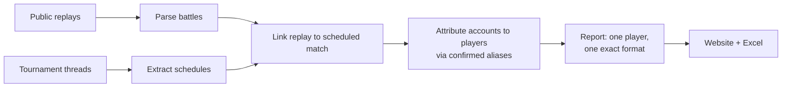

# SRS — Smogon Replay Scouter

**Scouting reports for competitive Pokémon tournaments, built from public game recordings.**

> **This repository is a project showcase.** It documents what SRS does, how it is designed, and
> what I learned building it. The implementation, the tests and the data are private and are **not**
> in this repository. You can try the working product on the live demo below.

*Independent project. Not affiliated with or endorsed by Smogon or Pokémon Showdown.*

## Why it exists

I play competitive Pokémon. Preparing for an opponent means finding their past tournament games:
scrolling tournament pages on the Smogon forums, opening replay pages one by one, and remembering
that the same person sometimes played under a different account name. SRS automates that work. It
collects public replays and tournament threads, works out which replay belongs to which scheduled
tournament match and which player, and turns a player's history into a searchable scouting page and
an Excel workbook.

No Pokémon knowledge is needed to follow it:

- **Player**: a person who competes in tournaments, under one canonical name.
- **Format**: the ruleset of a game (for example `gen6ou`: Generation 6, "OverUsed" tier).
  Statistics are never mixed across formats.
- **Team**: the six Pokémon a player brings. Only what the game revealed is shown.
- **Replay**: a public recording of one game on Pokémon Showdown, the online battle simulator.
- **Alternate account**: another username the same person played under, grouped under the player
  only through a confirmed alias with recorded evidence, not because two names look alike.

## Live demo

**https://srs-myk.duckdns.org** is private and login-only; there is no public sign-up. Reviewer
credentials are provided on request. After signing in, open **About** for a guided tour, or follow
the [reviewer guide](docs/REVIEWER_GUIDE.md).

The demo serves a **separate copy** of the data, restored from one snapshot
(`db-snapshot-20261006-085714`). It collects nothing new: acquisition runs only on my workstation,
and the site's update channel to that workstation is switched off in the deployed configuration.

Three verified starting points, measured against that snapshot with the site's own code and checked
on the live site:

| Player | Format | Tournament games | Record |
|---|---|---|---|
| NoName6293 | `gen6ou` | 84 | 54-30 |
| SoulWind | `gen5ou` | 101 | 65-36 (several account names, grouped by confirmed aliases) |
| ABR | `gen2ou` | 26 | 13-13 |

## How it works

Every stage keeps the raw evidence and refuses rather than guesses:
- a link needs proof from the thread the replay was posted in;
- an account reaches a player only through a confirmed alias;
- a stored link still has to pass withholding and reporting-eligibility checks before it counts;
- a report covers one exact format.

The website only **reads** the scouting data. Its writes are limited to website accounts, the
registry of generated reports, and the generated workbook files.

More detail: [Architecture](docs/ARCHITECTURE.md) · [Design decisions](docs/DESIGN_DECISIONS.md) ·
[Debugging case studies](docs/DEBUGGING_CASE_STUDIES.md) · [Project status](docs/PROJECT_STATUS.md)
· [Reviewer guide](docs/REVIEWER_GUIDE.md).

### Coverage is partial
Of **223,717** stored replays in the demo, **87,444** are linked to a scheduled match, **62,835**
of those to a match in an identified tournament, and **61,084** have at least one side attributed
to a tournament player; only those can appear in a tournament report. Some games are held back on
purpose because the evidence is incomplete or contradictory. Others are missing because of
acquisition and parser limits: replay pages that no longer exist, and forum layouts the extractor
cannot read yet. See [Project status](docs/PROJECT_STATUS.md).

Built with Python, PostgreSQL, a server-rendered web stack (no CDN, no client framework), and Excel
generation; deployed with systemd and nginx on one small VM.

## Testing (reported results)

The private test suite has about 10,000 tests. On 2026-10-06 the publishable subset of that suite was
measured with no database: **2,542 passed, 1,876 skipped** (the database tests), **0 failed**. That
covered parsing, schedule extraction, the database-free parts of linking and identity, the website,
and deployment configuration checks. It is a dated, reported result, not evidence about the whole
application. **The test suite is not in this repository.**

## Limitations

- **The implementation and data are private.** Raw third-party evidence (forum pages, replay files)
  is not distributed here.
- **Coverage is partial**, for both deliberate and technical reasons (above).
- **Linking and identity are implemented with partial coverage** and are conservative by design.
- **Only the Tournament pool is implemented.** Ladder and qualifier pools are not.
- **One host, no high availability.** Backups are scripted and run by hand.

## Licence

Not yet chosen. Until a licence is added, all rights are reserved.
