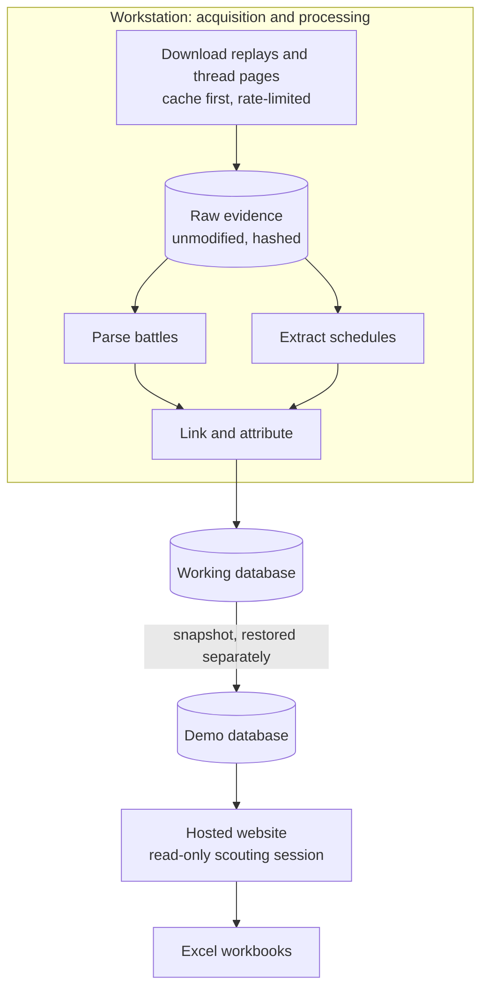

# Architecture

SRS is one Python application over one PostgreSQL database. The source is private, so this document
describes the design conceptually. Figures are from the demo snapshot `db-snapshot-20261006-085714`,
measured read-only.

## Where the work happens

- **On the workstation.** Acquisition runs cache-first at about one request per second, backs off on
  errors, and honours the server's `Retry-After`. It stores the untouched replay JSON and thread HTML
  with a content hash. Parsing, linking and identity also run there, as resumable jobs: each unit's
  outcome is recorded, so an interrupted run continues where it stopped.
- **On the demo host.** The site serves a database restored from one snapshot. In the deployed
  configuration it does not connect to the working database, and the update channel to the
  workstation refuses every call because no key is configured. A check run before the site starts
  confirms which database the service will serve.
- **Code and data are deployed separately.** A code release (an archive of one commit) and a refresh
  of the demo's database snapshot are separate operations. Deploying new code does not change the
  data the demo shows.

## Reads versus writes on the website

- **Scouting reads.** Every scouting page and report runs in a database session opened read-only,
  so PostgreSQL itself refuses a write there.
- **Website writes.** A separate session may write only an explicit allow-list of website tables:
  accounts (password hashes, sessions, invitations), the registry of generated workbooks, and the
  owner-only update-channel tables, which the demo does not use. Generated workbooks are written as
  files to a report directory.

## 1. Parsing a replay

A replay is parsed line by line, through typed handlers for each kind of protocol message over an
explicit model of the battle state. Regular expressions are used only to recognise URLs and ids. An
unrecognised message is recorded as a parser warning instead of stopping the parse. Each revealed fact
carries a certainty: *observed*, *mechanically implied*, *inferred*, *unknown* or *contradictory*.
Moves, items and abilities a game never revealed stay unknown; no "typical set" is filled in.
Re-parsing a replay replaces its parsed facts and never creates a second copy.

## 2. Reading tournament schedules

Forum threads are parsed into posts and replay-link occurrences, each keeping its surrounding text.
A layout reader turns a thread into scheduled matches; there are separate readers for team-tour weekly
slots, individual rounds and stage-titled sections. A layout no reader recognises is filed for
review, and nothing is invented for it. Bracket seeds written beside names are separated only when the
post itself proves a seeding ([case study 1](DEBUGGING_CASE_STUDIES.md)).

## 3. Format rules

Formats are compared exactly (`gen6ou` is not `gen6uu`, and generations are never pooled). The rule
depends on where a format claim comes from:

- **Schedule admission.** A schedule's format is graded against an explicit list of in-scope and
  excluded formats. An excluded format (Random Battles, for example) is skipped and counted. A format
  nobody has graded fails closed and goes to review. A matchup that states **no** format is still
  admitted, without one; 73,848 stored scheduled matches have none.
- **A missing scheduled format.** In the general linking rules, formats are compared only when both
  sides state one. A scheduled match with no format is an absence, not a disagreement, so any replay
  format is compatible with it. That is the historical behaviour, and links already made on that
  basis are kept. Two newer rules narrow it:
  - matches read from stage-titled sections that state no format cannot be linked until a source
    statement claims a format for them;
  - where an owner-approved record lists the formats a tournament allows (for example one match played
    across three formats), a replay outside that list is refused. Contradictory statements leave the
    match unresolved, and a statement whose source page has changed authorizes nothing.
- **One historical identity.** One alternative spelling of a format is mapped to the existing one,
  so a metagame is never split into two report scopes.
- **Legacy tokens.** Some old replays carry a format name with no generation (`uu`). It does not match
  a generation-specific schedule, and resolving it from context would be inference, so those pairs stay
  unlinked.

## 4. Linking a replay to a scheduled match

The replays posted in a thread are scored against **that thread's own** scheduled matches. The thread
is the provenance boundary, so two names that happen to coincide across unrelated tournaments are never
offered as a pair. A candidate needs both participants (an exact normalized name, or an
already-confirmed alias) and no format contradiction. Series-level checks can only weaken a verdict.

A stored link is materialised only from a confirmed candidate. Measured: each of the 87,444 stored
links has one (87,441 automatic, 3 decided by a person). Candidates that are probable, ambiguous or
in conflict are kept as the uncertainty record (136,742) rather than discarded.

Decisions made by a person are preserved: automation never rewrites a human-confirmed (3) or
human-rejected (22) candidate.

## 5. Identity: accounts, aliases and players

A replay records the literal Showdown account, and that string is never rewritten. A player reaches an
account only through an alias that has a status, a scope (global, or one tournament) and recorded
evidence. Inference rejects player order, name similarity and a partial series as evidence. When
reports are built, an account claimed by two players is attributed to nobody. Linking and identity
are implemented, but with **partial coverage**: many plausible connections stay unresolved.

## 6. Stored links versus reportable links

A stored link is not automatically reportable. Of the **87,444** stored links:

- **62,835** belong to a match whose tournament resolves, through its stage and season; only those can
  enter the Tournament pool.
- **466** are **withheld**: their proof rested on a claim that later lost its support. The link and
  its evidence are kept, and the attribution stays out of reports until it is resolved.
- Automated withholding does not apply to anything a person decided. A human-decided link or alias is
  left in place and reported separately for the owner to review.
- Reports then attribute each battle side only through confirmed, unwithheld aliases. **61,084**
  replays have at least one side attributed to a tournament player.

## 7. Reporting

A report gathers one player's evidence through confirmed aliases, keeps only the Tournament pool, and
computes statistics for one exact format. A pool that is not implemented is refused before any game is
read. Every game carries its provenance (where it was found and why it was included), and the
workbook's *Provenance & Scope* sheet prints it.

## The data model, conceptually

| Area | What it holds | Key relationship |
|---|---|---|
| Battles | replays, their two participants, revealed facts | a replay records literal account names; each fact has a certainty |
| Accounts | Showdown usernames | one record per normalized username |
| Sources | forum threads, posts, replay-link occurrences | one battle can be named by many posts; every occurrence is kept |
| Tournaments | tournament → edition → stage → scheduled match | a match names two players, and a format when the source states one |
| Linking | candidates with reasons; proven links | one battle belongs to at most one scheduled match |
| Identity | players, aliases, alias evidence | a player reaches accounts only through aliases |
| Review | open review items, acquisition errors | what could not be read, resolved or fetched |
| Website | accounts, report registry | separate from the scouting data |
| Freshness | one digest per (player, format) report scope | detects when a report is stale |

Schema changes are versioned migrations.

## The website

Server-rendered pages with no client framework and no CDN. Permissions are explicit per-role grants,
denied by default. There is no registration: accounts are created by the owner, or by invitation.
Roles: *owner* (all scouting pools, user management, invitations; still no power to approve canonical
evidence) and *user* or *contributor* (Tournament scouting, their own reports, Batch Scout).
